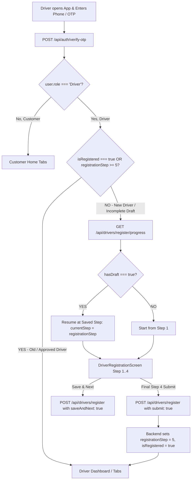

# 🚗 Driver One-Time Registration & Re-Login Flow Guide
> **For Frontend Developers (React Native / Web)**  
> **Backend Release**: Commit `32c70c0` on branch `main`  
> **Rule**: A driver must **ONLY register once in their lifetime**. Once registered, they must **never** see Step 1, 2, 3, or 4 upon logging in.

---

## 📌 1. High-Level Flow Architecture



---

## 🔑 2. The 4 Key Flags To Rely On

The backend now returns unified, explicit flags across **all** driver endpoints:

| Key Flag | Type | Old Driver (Already Registered) | New Driver (In Draft / Progress) | Fresh User (Not Registered) |
| :--- | :--- | :--- | :--- | :--- |
| `isRegistered` | `boolean` | `true` | `false` | `false` |
| `registrationCompleted` | `boolean` | `true` | `false` | `false` |
| `hasDraft` | `boolean` | `false` | `true` | `false` |
| `registrationStep` | `number` | **`5`** | `1`, `2`, `3`, or `4` | `1` |
| `kycStatus` | `string` | `"approved"` / `"verified"` | `"draft"` | `"draft"` |

---

## 🚀 3. Endpoint Specifications & Exact JSON Contracts

### Step 1: Authentication (`POST /api/auth/verify-otp` or `POST /api/auth/login`)
When a driver logs in with their phone number, the backend automatically looks up their Driver profile. If they have already completed registration, the backend automatically heals any legacy record to step 5 and returns `isRegistered: true`.

#### Request:
```http
POST /api/auth/verify-otp
Content-Type: application/json

{
  "firebaseIdToken": "<firebase_token_or_null>",
  "phone": "9876543210",
  "mode": "login"
}
```

#### Response (Old / Approved Driver - SKIP REGISTRATION):
```json
{
  "success": true,
  "accessToken": "eyJhbGciOiJIUzI1Ni...",
  "refreshToken": "eyJhbGciOiJIUzI1Ni...",
  "driverId": "12",
  "isRegistered": true,
  "registrationCompleted": true,
  "hasDraft": false,
  "registrationStep": 5,
  "nextStep": 5,
  "kycStatus": "approved",
  "user": {
    "id": "4",
    "name": "Ramesh Kumar",
    "phone": "9876543210",
    "email": "ramesh@example.com",
    "role": "Driver",
    "driverId": "12",
    "isRegistered": true,
    "registrationCompleted": true,
    "hasDraft": false,
    "registrationStep": 5,
    "nextStep": 5,
    "kycStatus": "approved"
  }
}
```

> **Frontend Action**: Check `res.data.isRegistered === true` or `res.data.user.isRegistered === true`.  
> If `true`, **immediately navigate to `DriverDashboard`**. Do NOT open `DriverRegistrationScreen`!

---

### Step 2: Driver Profile Check (`GET /api/drivers/me`)
Called on app launch or splash screen when token already exists in storage.

#### Request:
```http
GET /api/drivers/me
Authorization: Bearer <accessToken>
```

#### Response (Old / Approved Driver):
```json
{
  "success": true,
  "id": 12,
  "driverId": "12",
  "isRegistered": true,
  "registrationCompleted": true,
  "hasDraft": false,
  "name": "Ramesh Kumar",
  "phone": "9876543210",
  "email": "ramesh@example.com",
  "status": "online",
  "kyc": "approved",
  "kycStatus": "approved",
  "registrationStep": 5,
  "nextStep": 5,
  "vehicle": "Auto",
  "vehicleType": "Auto",
  "serviceType": "BOTH"
}
```

---

### Step 3: Registration Progress Check (`GET /api/drivers/register/progress`)
Only call this if `isRegistered === false` (e.g. uncompleted new driver resuming registration).

#### Request:
```http
GET /api/drivers/register/progress
Authorization: Bearer <accessToken>
```

#### Case A: If Driver is ALREADY Registered:
```json
{
  "success": true,
  "isRegistered": true,
  "registrationCompleted": true,
  "hasDraft": false,
  "registrationStep": 5,
  "nextStep": 5,
  "kycStatus": "approved"
}
```
*(Notice `hasDraft` is `false` and `registrationStep` is `5`. Frontend will never show step 2, 3, or 4!)*

#### Case B: If Driver has an UNFINISHED Draft:
```json
{
  "success": true,
  "isRegistered": false,
  "registrationCompleted": false,
  "hasDraft": true,
  "driverId": 15,
  "registrationStep": 3,
  "nextStep": 3,
  "kycStatus": "draft",
  "name": "New Driver",
  "phone": "9876500002",
  "vehicle": "Bike",
  "vehicleType": "Bike",
  "vehicleNumber": "KA01AB1234"
}
```
*(Resume at Step 3 with pre-filled values)*

---

### Step 4: Multi-Step Registration Submissions (`POST /api/drivers/register`)

#### A. Intermediate Steps (Step 1, Step 2, Step 3) -> "Save & Next"
Send `saveAndNext: true` with the current step number.
```http
POST /api/drivers/register
Authorization: Bearer <accessToken>
Content-Type: application/json

{
  "step": 1,
  "saveAndNext": true,
  "name": "Ramesh Kumar",
  "dob": "1994-06-15",
  "gender": "Male"
}
```
**Response**:
```json
{
  "success": true,
  "message": "Step data saved successfully",
  "isRegistered": false,
  "hasDraft": true,
  "registrationStep": 2,
  "nextStep": 2,
  "kycStatus": "draft"
}
```

#### B. Final Step (Step 4) -> Final Submit
Send `submit: true` on the final step.
```http
POST /api/drivers/register
Authorization: Bearer <accessToken>
Content-Type: application/json

{
  "step": 4,
  "submit": true,
  "accountHolderName": "Ramesh Kumar",
  "accountNumber": "50100012345678",
  "ifscCode": "HDFC0001234",
  "bankName": "HDFC Bank"
}
```
**Response**:
```json
{
  "success": true,
  "message": "Driver profile created and approved successfully",
  "isRegistered": true,
  "registrationCompleted": true,
  "hasDraft": false,
  "registrationStep": 5,
  "nextStep": 5,
  "kycStatus": "approved"
}
```
> **Frontend Action**: On receiving `isRegistered: true` or `registrationStep: 5`, show success message and navigate to `DriverDashboard`.

---

## 💻 4. Frontend Code Implementation Samples

### A. Auth Routing Logic (`RootNavigator.tsx` or `AuthContext.tsx`)
```typescript
const handleLoginSuccess = (loginResponse: any, navigation: any) => {
  const user = loginResponse.user;
  const isRegistered = loginResponse.isRegistered ?? user?.isRegistered;
  const step = loginResponse.registrationStep ?? user?.registrationStep ?? 1;

  if (user?.role === 'Driver') {
    // ONE-TIME REGISTRATION CHECK:
    if (isRegistered === true || step >= 5) {
      // Driver has already completed registration once in their lifetime:
      navigation.reset({
        index: 0,
        routes: [{ name: 'DriverDashboard' }], // Or 'DriverTabs'
      });
    } else {
      // Driver has an incomplete draft:
      navigation.reset({
        index: 0,
        routes: [{ name: 'DriverRegistrationScreen' }],
      });
    }
  } else {
    // Customer
    navigation.reset({
      index: 0,
      routes: [{ name: 'CustomerHome' }],
    });
  }
};
```

---

### B. Registration Draft Loader (`DriverRegistrationScreen.tsx`)
```typescript
useEffect(() => {
  const checkRegistrationProgress = async () => {
    try {
      const res = await axios.get('/api/drivers/register/progress');
      
      // 1. If already fully registered, redirect away immediately!
      if (res.data?.isRegistered === true || res.data?.registrationStep >= 5) {
        navigation.reset({
          index: 0,
          routes: [{ name: 'DriverDashboard' }],
        });
        return;
      }

      // 2. If uncompleted draft exists, restore saved fields and jump to step
      if (res.data?.hasDraft && res.data?.registrationStep < 5) {
        setFormData((prev) => ({
          ...prev,
          name: res.data.name || prev.name,
          phone: res.data.phone || prev.phone,
          dob: res.data.dob || prev.dob,
          gender: res.data.gender || prev.gender,
          vehicleType: res.data.vehicleType || prev.vehicleType,
          vehicleNumber: res.data.vehicleNumber || prev.vehicleNumber,
          licenseNumber: res.data.licenseNumber || prev.licenseNumber,
          aadhaarNumber: res.data.aadhaarNumber || prev.aadhaarNumber,
          panNumber: res.data.panNumber || prev.panNumber,
          accountNumber: res.data.accountNumber || prev.accountNumber,
          ifscCode: res.data.ifscCode || prev.ifscCode,
        }));
        
        if (res.data.registrationStep > 1) {
          setCurrentStep(res.data.registrationStep);
        }
      }
    } catch (err) {
      console.warn('Draft check error:', err);
    } finally {
      setIsLoading(false);
    }
  };

  checkRegistrationProgress();
}, []);
```

---

## 🧪 5. Testing Checklist for Frontend QA

| # | Test Scenario | Expected Frontend Behavior |
|---|---|---|
| **1** | **Old driver logs in via Phone / OTP** | App reads `isRegistered: true`, navigates **directly to DriverDashboard**. No registration screens appear. |
| **2** | **Old driver restarts / re-opens app** | Token verified -> `GET /api/drivers/me` returns `isRegistered: true`, opens **DriverDashboard**. |
| **3** | **New driver fills Step 1 & 2, closes app, reopens** | App calls `GET /api/drivers/register/progress` -> restores Step 1 & 2 data and resumes on **Step 3**. |
| **4** | **New driver completes Step 4 and clicks Submit** | Backend returns `isRegistered: true, registrationStep: 5` -> App shows success and navigates to **DriverDashboard**. Driver never sees registration again. |
