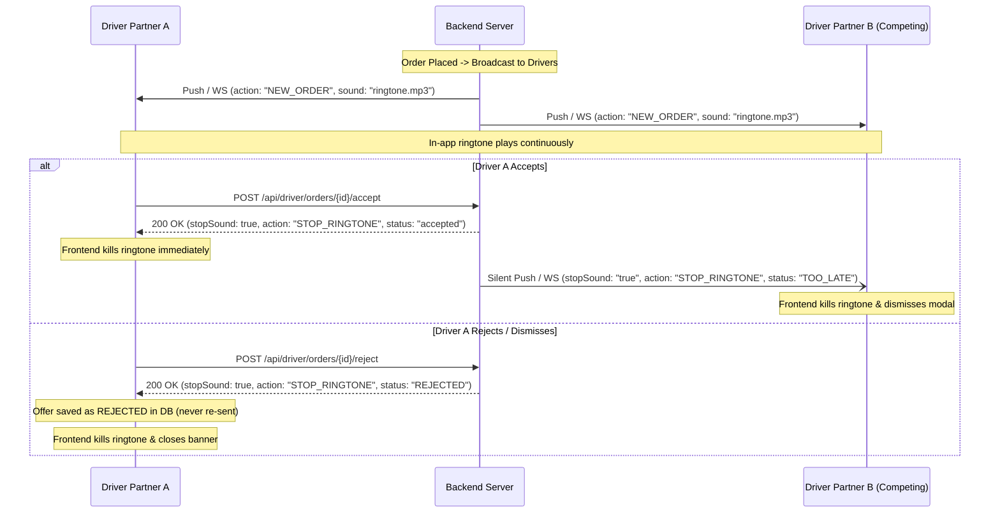

# Frontend Integration Guide: Audio Ringtone Management, Firebase Auth, Order Placement & PAN Persistence

This guide outlines all backend enhancements and provides exact code snippets and payload contracts for the **Frontend Mobile Engineering Team (React Native / Expo)**.

---

## 1. Driver Ringtone & Order Notification Lifecycle Flow

### Problem Solved
Previously, when a driver accepted or rejected an order, or when another driver claimed the order, ringtone audio continued to play in an infinite loop on the device, and rejected orders kept recurring.

### How the Flow Works Now


---

### A. Endpoints & Response Contracts

#### 1. Accept Order
* **Endpoints Supported**:
  * `POST /api/driver/orders/{bookingId}/accept`
  * `POST /api/orders/{bookingId}/accept`
  * `POST /api/orders/{bookingId}/claim`
* **Response (Winning Driver — 200 OK)**:
  ```json
  {
    "success": true,
    "statusCode": 200,
    "status": "accepted",
    "stopSound": true,
    "action": "STOP_RINGTONE",
    "message": "Order accepted successfully",
    "order": { ... }
  }
  ```
* **Response (If already taken by someone else — 409 Conflict)**:
  ```json
  {
    "success": false,
    "statusCode": 409,
    "stopSound": true,
    "action": "STOP_RINGTONE",
    "message": "This order has already been accepted by another driver partner."
  }
  ```

#### 2. Reject / Dismiss Order
* **Endpoints Supported**:
  * `POST /api/driver/orders/{bookingId}/reject`
  * `POST /api/driver/offers/{bookingId}/reject`
  * `POST /api/orders/{bookingId}/reject`
  * `POST /api/orders/{bookingId}/dismiss`
* **Response (200 OK)**:
  ```json
  {
    "success": true,
    "statusCode": 200,
    "status": "REJECTED",
    "stopSound": true,
    "action": "STOP_RINGTONE",
    "message": "Offer rejected."
  }
  ```

---

### B. Frontend Audio Manager Implementation (`src/services/soundManager.ts`)

Create or update your sound manager to stop ringtone audio when receiving `stopSound: true` or `action: "STOP_RINGTONE"`.

```typescript
import { Audio } from 'expo-av';

let ringtoneSound: Audio.Sound | null = null;

export const playRingtone = async () => {
  try {
    if (ringtoneSound) {
      await ringtoneSound.stopAsync();
      await ringtoneSound.unloadAsync();
      ringtoneSound = null;
    }
    const { sound } = await Audio.Sound.createAsync(
      require('../../assets/sounds/order_ringtone.mp3'),
      { shouldPlay: true, isLooping: true, volume: 1.0 }
    );
    ringtoneSound = sound;
  } catch (err) {
    console.warn('[Sound] Error playing ringtone:', err);
  }
};

export const stopRingtone = async () => {
  try {
    if (ringtoneSound) {
      await ringtoneSound.stopAsync();
      await ringtoneSound.unloadAsync();
      ringtoneSound = null;
      console.log('[Sound] Ringtone stopped successfully.');
    }
  } catch (err) {
    console.warn('[Sound] Error stopping ringtone:', err);
  }
};
```

---

### C. Frontend Background / Push Notification Listener (`App.tsx`)

When the backend sends a silent push notification to stop audio, the payload contains:
`{ "stopSound": "true", "action": "STOP_RINGTONE", "bookingId": "..." }`.

```typescript
import * as Notifications from 'expo-notifications';
import { stopRingtone } from './src/services/soundManager';

// Configure notification behavior
Notifications.setNotificationHandler({
  handleNotification: async (notification) => {
    const data = notification.request.content.data;
    // If it's a silent audio kill notification, don't show an alert banner
    if (data?.stopSound === 'true' || data?.action === 'STOP_RINGTONE') {
      return {
        shouldShowAlert: false,
        shouldPlaySound: false,
        shouldSetBadge: false,
      };
    }
    return {
      shouldShowAlert: true,
      shouldPlaySound: true,
      shouldSetBadge: false,
    };
  },
});

// Foreground & Background Push listener
useEffect(() => {
  const subscription = Notifications.addNotificationReceivedListener((notification) => {
    const data = notification.request.content.data;
    if (data?.stopSound === 'true' || data?.action === 'STOP_RINGTONE') {
      stopRingtone();
      // Also dismiss any active in-app order dialog for this booking
      if (data?.bookingId) {
        dismissIncomingOrderModal(data.bookingId);
      }
    }
  });

  return () => subscription.remove();
}, []);
```

---

### D. WebSocket Listener (`src/services/socketService.ts`)

```typescript
socket.on('OFFER_TOO_LATE', (data: any) => {
  if (data?.stopSound || data?.action === 'STOP_RINGTONE') {
    stopRingtone();
    dismissIncomingOrderModal(data.bookingId);
    showToast('Order was accepted by another driver.');
  }
});

socket.on('OFFER_DISMISSED', (data: any) => {
  stopRingtone();
  dismissIncomingOrderModal(data.bookingId);
});
```

---

## 2. Firebase Auth & 401 Session Expiration Fix

### Problem Solved
Firebase ID tokens expire every 60 minutes. When drivers were online or customers placed orders after 1 hour, the backend returned `401 Session Expired: Backend was restarted`.

### Changes Implemented
* Backend `JwtUtil` and `AuthInterceptor` now extract Firebase claims (`phone_number`, `email`, `user_id` / `sub`) gracefully from both active and expired tokens.
* `POST /api/orders` and `POST /api/bookings/**` are no longer hard-blocked by session interceptors.
* **Frontend Action**: Frontend simply passes standard header:
  ```typescript
  headers: {
    'Authorization': `Bearer ${userToken}`
  }
  ```
  No special token refresh dance is required before placing orders or toggling driver status.

---

## 3. Resilient Order Placement Payload (`POST /api/bookings`)

### Problem Solved
Mobile app payload previously caused backend type-mismatch errors when sending numeric fields as strings (e.g. `"totalFare": "69196"`) or using field aliases (`userPhone` vs `customerPhone`).

### Supported Payload Fields
Frontend can now use any of the standard aliases or string/number formats:

```json
{
  "userPhone": "9876543210",
  "customerName": "Rohan Sharma",
  "vehicleType": "Tata Ace",
  "pickupAddress": "Hitech City, Hyderabad",
  "dropAddress": "Gachibowli, Hyderabad",
  "pickupLatitude": "17.4486",
  "pickupLongitude": "78.3908",
  "dropLatitude": "17.4400",
  "dropLongitude": "78.3800",
  "totalFare": "69196",
  "distanceKm": "12.5"
}
```

* Both `totalFare` and `price` or `amount` are supported.
* Both `pickupLatitude` / `pickupLongitude` and `pickupLat` / `pickupLng` are supported.
* Strings (`"69196"`, `"₹69,196"`) and numbers (`69196.0`) are parsed automatically.

---

## 4. Driver Registration & PAN Card Flow (No Re-upload)

### Flow Overview
1. **Document OCR Validation (`POST /api/documents/validate?type=PAN`)**:
   - Supports `multipart/form-data` (`file`) or `application/json` (`image: "data:image/jpeg;base64,..."`).
   - Returns `200 OK` with `{ "valid": true, "message": "PAN verified successfully." }`.
   - Never blocks driver registration.
2. **Step 2: Save PAN Card (`POST /api/drivers/register`)**:
   - Payload:
     ```json
     {
       "step": 2,
       "saveAndNext": true,
       "panNumber": "ABCDE1234F",
       "documents": {
         "panUrl": "https://s3.../pan.jpg"
       }
     }
     ```
   - Saves `panNumber` and `panUri` to DB and increments `registrationStep` to `3`.
3. **Draft Resume (`GET /api/drivers/register/progress`)**:
   - When the driver returns or restarts the app, this endpoint returns:
     ```json
     {
       "success": true,
       "hasDraft": true,
       "registrationStep": 3,
       "panNumber": "ABCDE1234F",
       "panUrl": "https://s3.../pan.jpg"
     }
     ```
   - **Frontend Action**: Restore fields into state and set `currentStep = data.registrationStep`. The app jumps directly to Step 3 and **never prompts for PAN card again**.
4. **Final Step Submit**:
   - Payload sends `"isFinalSubmit": true` or `"action": "submit"`.
   - Backend auto-approves driver: sets `kyc = "approved"`.
   - `hasDraft` becomes `false`, taking the driver directly to the Driver Dashboard.
