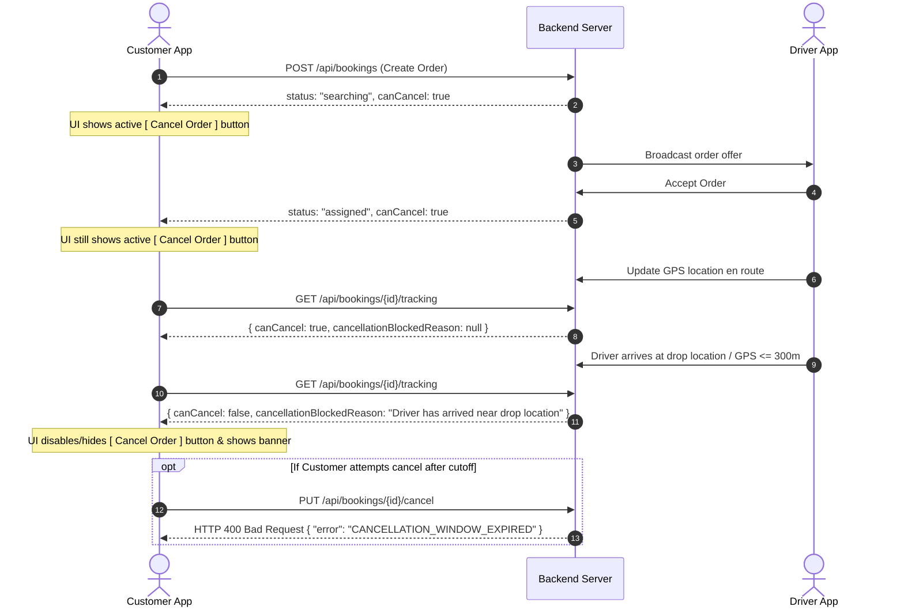

# Frontend Development & Testing Flow Guide

This document is designed for the Frontend Team (React Native / Expo / Web) to easily understand, test, and integrate the latest backend changes.

---

## 📱 Flow 1: Customer Order Cancellation Window

### 🎯 Business Logic:
- **Cancellation is ALLOWED (`canCancel: true`)**:
  - While placing the order (`searching`, `pending`, `created`, `placed`, `unassigned`).
  - When driver is assigned (`assigned`).
  - When driver is en route to pickup.
  - When driver arrived at pickup (`arrived_at_pickup`).
  - While in transit (`in_transit`), as long as the driver is **NOT yet near the drop location**.
- **Cancellation is BLOCKED (`canCancel: false`)**:
  - Once driver arrives near drop location (`driver_reached`, `arrived_at_drop`, `unloading`, etc., or GPS proximity $\le 300\text{ meters}$).
  - Once delivery OTP is verified (`otpVerified: true`).
  - Once order is completed or delivered (`delivered`, `completed`).

---

### 🔄 API Interaction Flow:



---

### 💻 Frontend Implementation Snippet:

```tsx
// 1. Fetch Tracking Data
const { data: tracking } = await axios.get(`/api/bookings/${bookingId}/tracking`);

// 2. Conditional UI Rendering
{tracking.canCancel ? (
  <TouchableOpacity
    onPress={handleCancelOrder}
    style={{ backgroundColor: '#FEE2E2', borderColor: '#EF4444', borderWidth: 1, padding: 12, borderRadius: 8 }}
  >
    <Text style={{ color: '#DC2626', fontWeight: 'bold', textAlign: 'center' }}>Cancel Order</Text>
  </TouchableOpacity>
) : (
  <View style={{ backgroundColor: '#F3F4F6', padding: 10, borderRadius: 8 }}>
    <Text style={{ color: '#6B7280', fontSize: 12, textAlign: 'center' }}>
      {tracking.cancellationBlockedReason || 'Cancellation is closed as driver has arrived near drop location.'}
    </Text>
  </View>
)}

// 3. Cancel Action (Auth token optional/whitelisted)
const handleCancelOrder = async () => {
  try {
    const res = await axios.put(`/api/bookings/${bookingId}/cancel`, {
      reason: 'Customer requested cancellation'
    });
    if (res.data.success) {
      Alert.alert('Success', 'Order cancelled successfully.');
      navigation.navigate('HomeScreen');
    }
  } catch (err: any) {
    Alert.alert('Cannot Cancel', err.response?.data?.message || 'Cancellation window expired.');
  }
};
```

---

## 🚚 Flow 2: Driver Registration & Avoiding "Account Not Found"

### 🎯 Root Cause & Fix:
- **Old Problem**: A newly authenticated driver calling `GET /api/drivers/me` received `401 Unauthorized or Driver profile not found`, triggering an "Account not found" alert and forcing re-registration.
- **Fixed Flow**:
  1. Driver logs in / verifies OTP via Firebase or Backend OTP.
  2. Frontend calls `GET /api/drivers/me` (or `GET /api/driver/me`).
  3. Backend automatically provisions/links a draft `Driver` profile with `registrationStep: 1` and `kycStatus: "draft"`.
  4. Frontend calls `GET /api/drivers/register/progress`.
  5. Backend returns all Step 1 fields (pre-filled with phone, name, email, dob, gender, and avatar).
  6. Driver continues smoothly without any "Account not found" loop!

---

### 📋 Step 1 Fields (Required in Frontend Form):

| Field Name | Type | UI Component | Default / Fallback |
| :--- | :--- | :--- | :--- |
| `profilePhotoUrl` / `profilePhotoUri` | `string` | Image picker with circular preview | SVG initials avatar |
| `name` | `string` | Text Input (Alphabets & spaces) | Pre-filled from login |
| `phone` | `string` | Numeric Phone Input (10 digits) | Pre-filled from login |
| `email` | `string` | Email Input | Pre-filled or `<phone>@anushaporter.com` |
| `dob` | `string` | Date Picker / Input (`YYYY-MM-DD`) | `'1995-01-01'` |
| `gender` | `string` | Selector Pills (`Male` / `Female` / `Other`) | `'Male'` |

---

### 🔄 Step 1 Code Sample (`DriverRegistrationStep1.tsx`):

```tsx
import React, { useState, useEffect } from 'react';
import { View, Text, TextInput, TouchableOpacity, Image, Alert } from 'react-native';
import axios from 'axios';

export const DriverRegistrationStep1 = ({ navigation }: any) => {
  const [formData, setFormData] = useState({
    name: '',
    phone: '',
    email: '',
    dob: '1995-01-01',
    gender: 'Male',
    profilePhotoUrl: '',
  });

  // Restore saved draft on mount
  useEffect(() => {
    axios.get('/api/drivers/register/progress')
      .then(res => {
        if (res.data) {
          setFormData(prev => ({
            ...prev,
            name: res.data.name || prev.name,
            phone: res.data.phone || prev.phone,
            email: res.data.email || prev.email,
            dob: res.data.dob || prev.dob,
            gender: res.data.gender || prev.gender,
            profilePhotoUrl: res.data.profilePhotoUrl || prev.profilePhotoUrl,
          }));
        }
      })
      .catch(err => console.warn('Could not load draft:', err));
  }, []);

  const handleSaveAndNext = async () => {
    try {
      const res = await axios.post('/api/drivers/register', {
        ...formData,
        step: 1,
        saveAndNext: true,
      });
      if (res.data.success) {
        navigation.navigate('DriverRegistrationStep2');
      }
    } catch (err: any) {
      Alert.alert('Error', err.response?.data?.message || 'Could not save step 1');
    }
  };

  return (
    <View style={{ padding: 16 }}>
      {/* 1. Profile Photo Picker */}
      <TouchableOpacity
        onPress={() => {/* Launch expo-image-picker and upload */}}
        style={{ alignSelf: 'center', width: 90, height: 90, borderRadius: 45, backgroundColor: '#E5E7EB', overflow: 'hidden', justifyContent: 'center', alignItems: 'center' }}
      >
        {formData.profilePhotoUrl ? (
          <Image source={{ uri: formData.profilePhotoUrl }} style={{ width: '100%', height: '100%' }} />
        ) : (
          <Text style={{ color: '#4B5563', fontSize: 12 }}>+ Photo</Text>
        )}
      </TouchableOpacity>

      {/* 2. Full Name */}
      <Text style={{ marginTop: 12 }}>Full Name *</Text>
      <TextInput value={formData.name} onChangeText={t => setFormData({ ...formData, name: t })} style={{ borderWidth: 1, borderColor: '#D1D5DB', borderRadius: 8, padding: 10 }} />

      {/* 3. Phone */}
      <Text style={{ marginTop: 12 }}>Phone Number *</Text>
      <TextInput value={formData.phone} keyboardType="phone-pad" editable={false} style={{ borderWidth: 1, borderColor: '#E5E7EB', backgroundColor: '#F9FAFB', borderRadius: 8, padding: 10 }} />

      {/* 4. Email */}
      <Text style={{ marginTop: 12 }}>Email Address *</Text>
      <TextInput value={formData.email} keyboardType="email-address" onChangeText={t => setFormData({ ...formData, email: t })} style={{ borderWidth: 1, borderColor: '#D1D5DB', borderRadius: 8, padding: 10 }} />

      {/* 5. Date of Birth */}
      <Text style={{ marginTop: 12 }}>Date of Birth (YYYY-MM-DD) *</Text>
      <TextInput value={formData.dob} placeholder="1995-01-01" onChangeText={t => setFormData({ ...formData, dob: t })} style={{ borderWidth: 1, borderColor: '#D1D5DB', borderRadius: 8, padding: 10 }} />

      {/* 6. Gender */}
      <Text style={{ marginTop: 12 }}>Gender *</Text>
      <View style={{ flexDirection: 'row', gap: 10, marginTop: 4 }}>
        {['Male', 'Female', 'Other'].map(g => (
          <TouchableOpacity
            key={g}
            onPress={() => setFormData({ ...formData, gender: g })}
            style={{ flex: 1, padding: 10, borderRadius: 8, borderWidth: 1, borderColor: formData.gender === g ? '#2563EB' : '#D1D5DB', backgroundColor: formData.gender === g ? '#EFF6FF' : '#FFF', alignItems: 'center' }}
          >
            <Text style={{ color: formData.gender === g ? '#2563EB' : '#374151' }}>{g}</Text>
          </TouchableOpacity>
        ))}
      </View>

      <TouchableOpacity onPress={handleSaveAndNext} style={{ marginTop: 24, backgroundColor: '#2563EB', padding: 14, borderRadius: 8, alignItems: 'center' }}>
        <Text style={{ color: '#FFF', fontWeight: 'bold' }}>Save and Next</Text>
      </TouchableOpacity>
    </View>
  );
};
```

---

## 🔔 Flow 3: Multi-Driver Simultaneous Broadcast & Ringtone Stop

### 🎯 Architecture:
1. **Simultaneous Broadcast**:
   - Backend queries all eligible online drivers within radius (starts at 5km, then 10km, etc.).
   - Dispatches FCM Push (`type: "DRIVER_OFFER"`) and WebSocket offers to all drivers at once.
2. **Instant Ringtone Stop on Ride Acceptance**:
   - As soon as **ANY** driver accepts the ride:
     - Winning driver receives `200 OK` with `{ status: "ASSIGNED" }`.
     - All other drivers receive a silent push notification:
       ```json
       {
         "type": "STOP_DRIVER_OFFER",
         "action": "STOP_RINGTONE",
         "bookingId": "BK-1002"
       }
       ```
     - Telemetry WebSocket broadcast:
       ```json
       {
         "type": "driver:offer:stop",
         "action": "STOP_RINGTONE",
         "bookingId": "BK-1002"
       }
       ```

---

### 🎧 Driver App Audio & Popup Handler:

```typescript
import { useEffect } from 'react';
import * as Notifications from 'expo-notifications';
import { Audio } from 'expo-av';

let ringtoneSound: Audio.Sound | null = null;

export const useIncomingRideListener = (
  onShowModal: (offer: any) => void,
  onDismissModal: (bookingId: string) => void
) => {
  useEffect(() => {
    // 1. Listen for Push Notifications (FCM)
    const subscription = Notifications.addNotificationReceivedListener((notification) => {
      const data = notification.request.content.data;

      // STOP RINGTONE & DISMISS OFFER
      if (data?.action === 'STOP_RINGTONE' || data?.type === 'STOP_DRIVER_OFFER') {
        stopSound();
        if (data?.bookingId) {
          onDismissModal(data.bookingId);
        }
      }

      // NEW INCOMING RIDE OFFER
      if (data?.type === 'DRIVER_OFFER' && data?.action !== 'STOP_RINGTONE') {
        playSound();
        onShowModal(data);
      }
    });

    // 2. Listen for WebSocket (Realtime Fallback)
    const socket = new WebSocket('wss://api.anushaporter.com/ws/telemetry');
    socket.onmessage = (event) => {
      try {
        const msg = JSON.parse(event.data);
        if (msg.type === 'driver:offer:stop' || msg.action === 'STOP_RINGTONE') {
          stopSound();
          if (msg.bookingId) onDismissModal(msg.bookingId);
        }
      } catch (e) {}
    };

    return () => {
      subscription.remove();
      socket.close();
      stopSound();
    };
  }, []);

  const playSound = async () => {
    try {
      if (!ringtoneSound) {
        const { sound } = await Audio.Sound.createAsync(
          require('../assets/sounds/incoming_order.mp3'),
          { shouldPlay: true, isLooping: true }
        );
        ringtoneSound = sound;
      } else {
        await ringtoneSound.playAsync();
      }
    } catch (e) {
      console.warn('Sound play error:', e);
    }
  };

  const stopSound = async () => {
    try {
      if (ringtoneSound) {
        await ringtoneSound.stopAsync();
        await ringtoneSound.unloadAsync();
        ringtoneSound = null;
      }
    } catch (e) {
      console.warn('Sound stop error:', e);
    }
  };
};
```

---

## 📦 Flow 4: Real Assigned Driver Profile & Delivery OTP

### 1. Real Driver Info in Tracking:
In `GET /api/bookings/{id}/tracking`:
```json
{
  "success": true,
  "bookingId": "BK-2001",
  "status": "in_transit",
  "canCancel": true,
  "otp": "4819",
  "deliveryOtp": "4819",
  "driver": {
    "id": "15",
    "name": "Suresh Varma",
    "phone": "9848012345",
    "vehicleNumber": "TS 09 XY 9999",
    "vehicleType": "Tata Ace",
    "rating": 4.9,
    "latitude": 17.4495,
    "longitude": 78.3850
  },
  "assignedDriver": { /* same object for backwards compatibility */ },
  "driverInfo": { /* same object for backwards compatibility */ }
}
```
* Note: `"Manjunath (Supervisor)"` will **never** appear for actual assigned orders. It only acts as an unassigned demo placeholder if no driver has been assigned to a Packers shift yet.

### 2. Delivery OTP Endpoints:
The frontend can query any of the following aliases; all return `otp` and `deliveryOtp`:
- `GET /api/bookings/{id}/delivery-otp`
- `GET /api/bookings/{id}/otp`
- `GET /api/orders/{id}/delivery-otp`
- `GET /api/orders/{id}/otp`

All return:
```json
{
  "success": true,
  "bookingId": "BK-2001",
  "otp": "4819",
  "deliveryOtp": "4819",
  "data": {
    "otp": "4819",
    "deliveryOtp": "4819"
  }
}
```
