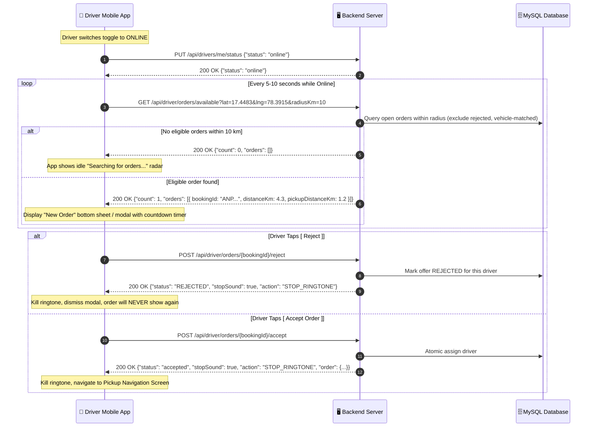

# Frontend Integration & Testing Flow: Driver Offers, Proximity Filtering & Rejection Flow

This document details the updated dispatch and order polling flow for the **Frontend Mobile Engineering Team (React Native / Flutter / Android / iOS)**.

---

## 🚀 Summary of Recent Backend Enhancements

| Issue Resolved | Backend Behavior Now | Frontend Impact |
|---|---|---|
| **Orders 100+ km away appearing** | Strict Haversine distance filtering (default: 10 km) applied to `GET /api/driver/orders/available`. | Only local, nearby orders within radius are delivered. |
| **Multiple requests popping in a row** | Available orders are sorted by proximity (closest pickup first). Orders older than 15 minutes are auto-expired. | No sequential pop-up spam when driver goes online. |
| **Rejected order reappearing on poll** | Backend permanently records driver rejections and filters them out from `/driver/orders/available`. | Rejecting an order guarantees it will **never** be served to that driver again. |
| **Stale ghost test orders** | Startup auto-cleaner (`StaleOrderCleanupRunner`) cleans unassigned orders older than 10 mins. | Ghost test orders from days/hours ago will never pop up. |
| **Active trip protection** | If driver is currently on an active order (`ASSIGNED`, `IN_TRANSIT`, etc.), available orders returns empty. | Active deliveries will never be interrupted by new ride popups. |

---

## 🔄 End-to-End Driver Dispatch Sequence



---

## 📡 API Contracts for Frontend Development

### 1. Toggle Online / Offline Status
Call this when the driver switches the status toggle in the header or dashboard.

* **Method**: `PUT`
* **Path**: `/api/drivers/me/status` *(or `/api/drivers/email/{email}/status`)*
* **Headers**:
  ```http
  Authorization: Bearer <driver_jwt>
  Content-Type: application/json
  ```
* **Request Body**:
  ```json
  {
    "status": "online" // or "offline"
  }
  ```
* **Response (200 OK)**:
  ```json
  {
    "success": true,
    "status": "online",
    "driver": {
      "id": 101,
      "name": "Rajesh Kumar",
      "status": "online",
      "vehicleType": "Truck"
    }
  }
  ```

---

### 2. Poll Available Orders (Crucial Frontend Change)
While online, the frontend should poll this endpoint every 5 to 10 seconds.

> ⚠️ **Important Change**: Always pass the driver's current GPS `lat` and `lng` as query parameters!

* **Method**: `GET`
* **Path**: `/api/driver/orders/available?lat={latitude}&lng={longitude}&radiusKm=10`
* **Headers**:
  ```http
  Authorization: Bearer <driver_jwt>
  ```
* **Query Parameters**:
  - `lat` *(number, required)*: Driver's current GPS latitude (e.g. `17.4483`).
  - `lng` *(number, required)*: Driver's current GPS longitude (e.g. `78.3915`).
  - `radiusKm` *(number, optional, default: 10)*: Radius limit in kilometers.
* **Response when orders exist (200 OK)**:
  ```json
  {
    "success": true,
    "count": 1,
    "orders": [
      {
        "id": 402,
        "bookingId": "ANP124956",
        "serviceName": "Truck",
        "pickupAddress": "Madhapur, Hyderabad",
        "dropAddress": "Kondapur, Hyderabad",
        "pickupLat": 17.4483,
        "pickupLng": 78.3915,
        "dropLat": 17.4560,
        "dropLng": 78.4000,
        "amount": 100.0,
        "fare": 100.0,
        "distanceKm": 4.3,
        "pickupDistanceKm": 0.5,
        "status": "available",
        "createdAt": "2026-09-17T14:30:00"
      }
    ]
  }
  ```
* **Response when no orders or driver is on active trip (200 OK)**:
  ```json
  {
    "success": true,
    "count": 0,
    "orders": [],
    "availableOrders": [],
    "offers": [],
    "data": []
  }
  ```

---

### 3. Reject / Dismiss Order
Call this when the driver taps the **[ Reject ]** button or when the countdown timer hits 0.

* **Method**: `POST`
* **Path**: `/api/driver/orders/{bookingId}/reject` *(or `/api/driver/offers/{bookingId}/reject`)*
* **Headers**:
  ```http
  Authorization: Bearer <driver_jwt>
  ```
* **Response (200 OK)**:
  ```json
  {
    "success": true,
    "status": "REJECTED",
    "stopSound": true,
    "action": "STOP_RINGTONE",
    "message": "Offer rejected."
  }
  ```
* **Frontend Actions**:
  1. Stop ringtone audio immediately.
  2. Dismiss modal/sheet.
  3. The rejected booking is permanently excluded from all future polls.

---

### 4. Accept Order (Atomic First-Come, First-Served)
Call this when the driver taps **[ Accept Order ]**.

* **Method**: `POST`
* **Path**: `/api/driver/orders/{bookingId}/accept`
* **Headers**:
  ```http
  Authorization: Bearer <driver_jwt>
  ```
* **Response (200 OK — You Won)**:
  ```json
  {
    "success": true,
    "statusCode": 200,
    "status": "accepted",
    "stopSound": true,
    "action": "STOP_RINGTONE",
    "message": "Order accepted successfully",
    "bookingId": "ANP124956",
    "order": { ... }
  }
  ```
* **Response (409 Conflict — Another Driver Accepted First)**:
  ```json
  {
    "success": false,
    "statusCode": 409,
    "status": "TOO_LATE",
    "stopSound": true,
    "action": "STOP_RINGTONE",
    "message": "Another driver partner has already accepted this booking."
  }
  ```

---

## 📱 Recommended Frontend Implementation (React Native Example)

```typescript
import React, { useState, useEffect, useRef } from 'react';
import { stopRingtone, playRingtone } from './soundManager';

interface AvailableOrder {
  bookingId: string;
  serviceName: string;
  pickupAddress: string;
  dropAddress: string;
  amount: number;
  distanceKm: number;
  pickupDistanceKm?: number;
}

export const useDriverAvailableOrders = (isOnline: boolean, driverLat: number, driverLng: number) => {
  const [currentOffer, setCurrentOffer] = useState<AvailableOrder | null>(null);
  const activeOfferRef = useRef<AvailableOrder | null>(null);

  useEffect(() => {
    if (!isOnline) {
      if (activeOfferRef.current) {
        stopRingtone();
        setCurrentOffer(null);
      }
      return;
    }

    const pollOrders = async () => {
      // Don't poll or replace if driver is currently looking at an incoming offer modal
      if (activeOfferRef.current) return;

      try {
        const res = await api.get(
          `/api/driver/orders/available?lat=${driverLat}&lng=${driverLng}&radiusKm=10`
        );
        const orders: AvailableOrder[] = res.data?.orders || [];

        if (orders.length > 0 && !activeOfferRef.current) {
          // Take the closest/first order
          const nextOrder = orders[0];
          activeOfferRef.current = nextOrder;
          setCurrentOffer(nextOrder);
          playRingtone();
        }
      } catch (err) {
        console.warn('Error polling available orders:', err);
      }
    };

    pollOrders();
    const interval = setInterval(pollOrders, 6000);
    return () => clearInterval(interval);
  }, [isOnline, driverLat, driverLng]);

  const handleReject = async (bookingId: string) => {
    try {
      stopRingtone();
      activeOfferRef.current = null;
      setCurrentOffer(null);
      await api.post(`/api/driver/orders/${bookingId}/reject`);
    } catch (err) {
      console.warn('Reject error:', err);
    }
  };

  const handleAccept = async (bookingId: string) => {
    try {
      stopRingtone();
      const res = await api.post(`/api/driver/orders/${bookingId}/accept`);
      activeOfferRef.current = null;
      setCurrentOffer(null);
      return res.data;
    } catch (err: any) {
      stopRingtone();
      activeOfferRef.current = null;
      setCurrentOffer(null);
      throw err;
    }
  };

  return { currentOffer, handleReject, handleAccept };
};
```

---

## 🧪 Frontend Developer Testing Checklist

1. **Verify Proximity**:
   - Turn **Online** with GPS set to Hyderabad (`lat=17.4483, lng=78.3915`).
   - Confirm only local Hyderabad orders appear; distant orders (e.g. 100+ km away) are **never** returned.
2. **Verify Single Rejection**:
   - When an order appears, tap **[ Reject ]**.
   - Check that the ringtone stops immediately and the modal closes.
   - Wait 15 seconds; confirm that the rejected order **never** pops up again.
3. **Verify Active Trip Isolation**:
   - Accept an order.
   - Confirm that while on the active order, `/driver/orders/available` returns `count: 0`, and no new order modals interrupt your delivery.
