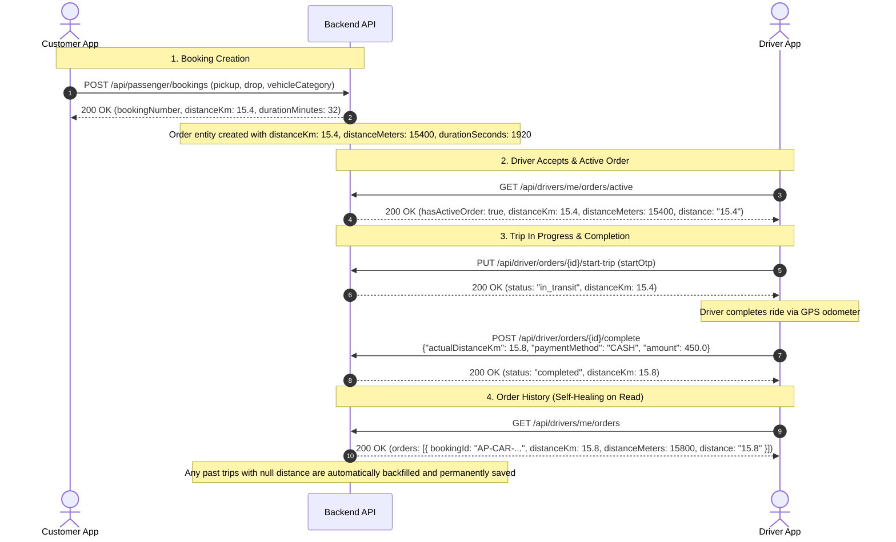

# Frontend Integration & Flow Guide: Trip Distance Resolution & Telemetry

This guide provides the complete flow, API contracts, and frontend implementation instructions for the **Driver App** and **Customer App** teams to check, test, and develop against.

---

## 1. End-to-End Flow Overview



---

## 2. What Changed on the Backend

| Scenario | Previous Behavior | New Behavior |
| :--- | :--- | :--- |
| **New Booking** | `Order` entity saved with `distanceKm: null` | `Order` entity pre-populated with `distanceKm`, `distanceMeters`, and `durationSeconds` |
| **Order Accept / Start** | Distance was not synced to `Order` | Auto-synced from `PassengerBooking` or calculated via Haversine |
| **Trip Completion** | Only payment was recorded; actual GPS distance ignored | Accepts `actualDistanceKm` / `distanceKm` from driver app GPS odometer |
| **Active Order (`/active`)** | Missing `distanceKm` or returned `null` | Returns `distanceKm`, `distanceMeters`, `durationSeconds`, and `distance` string |
| **Past Trips (`/orders/history`)** | Returned `"distanceKm": null, "distanceMeters": null` | **Self-healing:** Auto-populates from `PassengerBooking` or coordinates, saves to DB, returns valid numbers |

---

## 3. API Contracts for Frontend

### A. Driver Ride History
* **Endpoints**:
  - `GET /api/drivers/me/orders`
  - `GET /api/drivers/me/orders/history`
  - `GET /api/drivers/me/orders/completed`
* **Headers**: `Authorization: Bearer <driver_token>`
* **Response Body (200 OK)**:
```json
{
  "success": true,
  "totalOrders": 12,
  "completedOrders": 11,
  "totalEarnings": 4820.0,
  "orders": [
    {
      "orderId": "AP-CAR-260930170999",
      "bookingId": "AP-CAR-260930170999",
      "status": "completed",
      "fare": 450.0,
      "amount": 450.0,
      "pickupAddress": "Hitec City, Hyderabad",
      "dropAddress": "Secunderabad Railway Station, Hyderabad",
      "serviceName": "SEDAN",
      "distance": "15.4",
      "distanceKm": 15.4,
      "distanceMeters": 15400,
      "durationSeconds": 1920,
      "paymentMethod": "CASH",
      "createdAt": "2026-09-30T17:00:00"
    }
  ]
}
```

> **Key Takeaway**: Past completed orders that previously returned `null` will now automatically return non-null distance numbers upon the very next fetch.

---

### B. Driver Active Order
* **Endpoints**:
  - `GET /api/drivers/me/orders/active`
  - `GET /api/driver/orders/active`
* **Headers**: `Authorization: Bearer <driver_token>`
* **Response Body (200 OK - Active Ride Found)**:
```json
{
  "success": true,
  "hasActiveOrder": true,
  "orderId": 204,
  "bookingId": "AP-CAR-260930170888",
  "status": "in_transit",
  "customerName": "Ramesh Kumar",
  "customerPhone": "9876543210",
  "pickupAddress": "Madhapur, Hyderabad",
  "dropAddress": "Banjara Hills, Hyderabad",
  "pickupLat": 17.4485,
  "pickupLng": 78.3908,
  "dropLat": 17.4156,
  "dropLng": 78.4350,
  "amount": 220.0,
  "distance": "8.5",
  "distanceKm": 8.5,
  "distanceMeters": 8500,
  "durationSeconds": 1080,
  "deliveryOtp": "8813",
  "startOtp": "8813",
  "serviceType": "PASSENGER",
  "serviceName": "HATCHBACK",
  "passengerCount": 2,
  "serviceLabel": "Passenger Ride (2 Riders)",
  "order": {
    "bookingId": "AP-CAR-260930170888",
    "distanceKm": 8.5,
    "distanceMeters": 8500,
    "durationSeconds": 1080,
    "distance": "8.5"
  }
}
```

> **Note**: For 100% backward and forward compatibility, the distance fields are returned **both at the root level and under the `order` object**.

---

### C. Driver Ride Completion (Sending Actual GPS Telemetry)
* **Endpoints**:
  - `POST /api/driver/orders/{bookingId}/complete`
  - `POST /api/driver/orders/{orderId}/complete`
  - `POST /api/orders/{bookingId}/confirm-payment`
* **Headers**: `Authorization: Bearer <driver_token>`, `Content-Type: application/json`
* **Request Payload**:
```json
{
  "bookingId": "AP-CAR-260930170888",
  "paymentMethod": "CASH",
  "amount": 220.0,
  "actualDistanceKm": 8.7,
  "distanceKm": 8.7
}
```

| Field | Type | Description |
| :--- | :--- | :--- |
| `actualDistanceKm` | Number (optional) | Live GPS odometer distance tracked during the ride. |
| `distanceKm` | Number (optional) | Alternative field alias for `actualDistanceKm`. |
| `paymentMethod` | String | `"CASH"` or `"UPI"` or `"ONLINE"`. |
| `amount` | Number | Final fare collected. |

> **Backend Behavior**: If the driver app sends `actualDistanceKm` or `distanceKm`, the backend saves this actual driven distance. If omitted, the backend preserves the pricing distance calculated at booking time.

---

## 4. Frontend Implementation & Verification Checklist

### For Driver App Developers (React Native / Flutter / Android):

1. **History Screen (`RideHistoryScreen` / `OrderCard`)**:
   - Locate the component rendering the distance badge.
   - Update the text extraction to use resilient fallbacks:
     ```javascript
     const formatTripDistance = (order) => {
       if (order?.distanceKm != null && !isNaN(order.distanceKm) && order.distanceKm > 0) {
         return `${Number(order.distanceKm).toFixed(1)} km`;
       }
       if (order?.distanceMeters != null && order.distanceMeters > 0) {
         return `${(order.distanceMeters / 1000).toFixed(1)} km`;
       }
       if (order?.distance && order.distance !== '0' && order.distance !== '0.0') {
         return `${order.distance} km`;
       }
       return '-- km';
     };
     ```

2. **Active Ride Screen (`ActiveRideScreen`)**:
   - Verify distance displays on the HUD/dashboard:
     ```javascript
     const rideDistance = 
       activeOrder?.distanceKm ?? 
       activeOrder?.order?.distanceKm ?? 
       (activeOrder?.distanceMeters ? activeOrder.distanceMeters / 1000 : null) ?? 
       0;
     ```

3. **Trip Completion Modal (`EndTripModal` / `CompleteRideModal`)**:
   - When calling `/complete`, include the driver's accumulated location distance:
     ```javascript
     const completeTrip = async (bookingId, collectedAmount, paymentMode) => {
       const payload = {
         bookingId: bookingId,
         amount: collectedAmount,
         paymentMethod: paymentMode,
         actualDistanceKm: trackedGpsDistanceKm // Pass GPS odometer reading
       };
       return await api.post(`/api/driver/orders/${bookingId}/complete`, payload);
     };
     ```

---

### For Customer App Developers:

1. **Ride Details Screen (`BookingDetailScreen`)**:
   - Fetching `GET /api/bookings/{bookingId}` or `GET /api/orders/{id}` returns:
     ```json
     {
       "distanceKm": 15.4,
       "distanceMeters": 15400,
       "durationSeconds": 1920
     }
     ```
   - No changes needed unless the customer app was previously defaulting to `0 km` when reading `null`.
