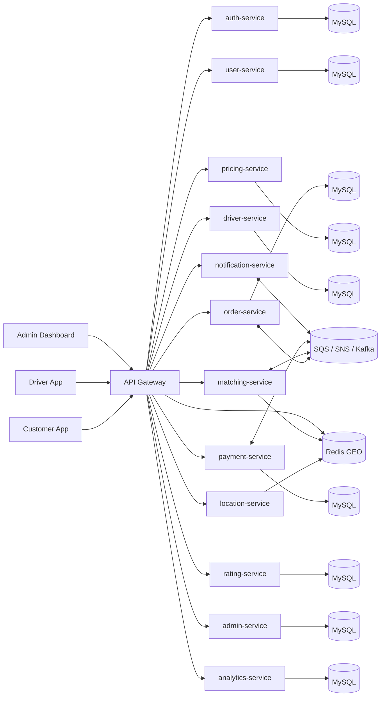

# Day 2 Architecture Design

This document captures the first production-oriented architecture draft for the Porter-like logistics platform.

## Goals

- Finalize the microservices list
- Define service ownership boundaries
- Draft the first version of the database schema
- Draft the first API contract set
- Establish the event and communication model

## Service Inventory

| Service | Responsibility | Primary Storage |
| --- | --- | --- |
| `api-gateway` | Routing, auth filter, rate limiting, Swagger aggregation | Redis for rate limits |
| `auth-service` | JWT issuance, refresh tokens, OTP, OAuth2 login | MySQL + Redis |
| `user-service` | Customer and driver profiles, roles, addresses | MySQL |
| `driver-service` | Driver onboarding, KYC documents, vehicle data, availability | MySQL + S3 |
| `order-service` | Order lifecycle, state transitions, history | MySQL |
| `pricing-service` | Fare estimation, surge pricing, fee computation | MySQL + Redis |
| `location-service` | GPS ingest, geo search, ETA support | Redis GEO |
| `matching-service` | Driver matching and reassignment | Redis |
| `payment-service` | Wallet, gateway integration, refunds, payouts | MySQL |
| `notification-service` | SMS, email, push, in-app notifications | Queue consumers |
| `rating-service` | Reviews, scores, driver feedback | MySQL |
| `admin-service` | Admin APIs, moderation, reports | MySQL |
| `analytics-service` | Operational metrics and reports | MySQL + S3 |

## High-Level Architecture

## Communication Rules

- Synchronous requests use REST through the API Gateway.
- Async lifecycle events use SQS/SNS, with Kafka reserved for higher-throughput internal streams.
- Each service owns its own database schema.
- No service reads another service's tables directly.
- Cross-service data is shared by API calls, events, or denormalized projections.

## First-Pass Database Schema

### `users` table

| Column | Type | Notes |
| --- | --- | --- |
| `id` | BIGINT PK AUTO | Internal primary key |
| `uuid` | VARCHAR(36) UNIQUE | Public identifier |
| `full_name` | VARCHAR(100) | Display name |
| `email` | VARCHAR(150) UNIQUE | Login email |
| `phone` | VARCHAR(15) UNIQUE | OTP login phone |
| `password_hash` | VARCHAR(255) NULL | Null for OAuth users |
| `role` | ENUM | CUSTOMER, DRIVER, ADMIN |
| `status` | ENUM | ACTIVE, SUSPENDED, PENDING_VERIFY |
| `email_verified` | TINYINT(1) | 0/1 flag |
| `phone_verified` | TINYINT(1) | 0/1 flag |
| `profile_photo_url` | VARCHAR(500) NULL | S3 URL |
| `created_at` | DATETIME | Created timestamp |
| `updated_at` | DATETIME | Updated timestamp |

### `orders` table

| Column | Type | Notes |
| --- | --- | --- |
| `id` | BIGINT PK AUTO | Internal primary key |
| `order_uuid` | VARCHAR(36) UNIQUE | Public order ID |
| `customer_uuid` | VARCHAR(36) | Customer reference |
| `driver_uuid` | VARCHAR(36) NULL | Assigned driver reference |
| `vehicle_type` | ENUM | BIKE, AUTO, MINI_TRUCK, LARGE_TRUCK |
| `pickup_address` | TEXT | JSON blob with address and coordinates |
| `drop_address` | TEXT | JSON blob with address and coordinates |
| `distance_km` | DECIMAL(8,2) | Route distance |
| `estimated_fare` | DECIMAL(10,2) | Fare shown at booking |
| `final_fare` | DECIMAL(10,2) NULL | Final fare after completion |
| `status` | ENUM | PENDING, FINDING_DRIVER, ASSIGNED, IN_TRANSIT, DELIVERED, CANCELLED, FAILED |
| `payment_status` | ENUM | PENDING, PAID, REFUNDED |
| `scheduled_at` | DATETIME NULL | Optional schedule time |
| `assigned_at` | DATETIME NULL | Assignment timestamp |
| `picked_up_at` | DATETIME NULL | Pickup timestamp |
| `delivered_at` | DATETIME NULL | Completion timestamp |
| `created_at` | DATETIME | Created timestamp |

### `drivers` table

| Column | Type | Notes |
| --- | --- | --- |
| `id` | BIGINT PK AUTO | Internal primary key |
| `driver_uuid` | VARCHAR(36) UNIQUE | Public driver ID |
| `user_uuid` | VARCHAR(36) UNIQUE | Links to user profile |
| `vehicle_type` | ENUM | Current vehicle class |
| `vehicle_number` | VARCHAR(30) | Vehicle registration |
| `license_number` | VARCHAR(50) | Driving license |
| `availability_status` | ENUM | ONLINE, OFFLINE, BUSY |
| `kyc_status` | ENUM | PENDING, VERIFIED, REJECTED |
| `rating_score` | DECIMAL(3,2) | Aggregated score |
| `created_at` | DATETIME | Created timestamp |
| `updated_at` | DATETIME | Updated timestamp |

### `payments` table

| Column | Type | Notes |
| --- | --- | --- |
| `id` | BIGINT PK AUTO | Internal primary key |
| `payment_uuid` | VARCHAR(36) UNIQUE | Public payment ID |
| `order_uuid` | VARCHAR(36) | Related order |
| `user_uuid` | VARCHAR(36) | Paying user |
| `amount` | DECIMAL(10,2) | Payment amount |
| `currency` | VARCHAR(10) | Usually INR |
| `provider` | ENUM | RAZORPAY, STRIPE, WALLET |
| `status` | ENUM | INITIATED, SUCCESS, FAILED, REFUNDED |
| `gateway_ref` | VARCHAR(100) NULL | Provider reference |
| `created_at` | DATETIME | Created timestamp |
| `updated_at` | DATETIME | Updated timestamp |

## API Draft

### Auth

- `POST /api/v1/auth/register`
- `POST /api/v1/auth/login`
- `POST /api/v1/auth/refresh`
- `POST /api/v1/auth/logout`
- `POST /api/v1/auth/otp/send`
- `POST /api/v1/auth/otp/verify`

### Orders

- `POST /api/v1/orders`
- `GET /api/v1/orders/{id}`
- `GET /api/v1/orders/my`
- `PUT /api/v1/orders/{id}/cancel`
- `POST /api/v1/orders/{id}/rate`

### Drivers

- `POST /api/v1/drivers/register`
- `PUT /api/v1/drivers/availability`
- `POST /api/v1/drivers/location`
- `GET /api/v1/drivers/orders/pending`
- `PUT /api/v1/drivers/orders/{id}/accept`
- `PUT /api/v1/drivers/orders/{id}/status`

### Pricing

- `POST /api/v1/pricing/estimate`
- `GET /api/v1/pricing/surge/{zone}`

### Payments

- `POST /api/v1/payments/initiate`
- `POST /api/v1/payments/confirm`
- `GET /api/v1/payments/wallet`
- `POST /api/v1/payments/wallet/topup`

## API Standards

- Base path: `/api/v1`
- Payload format: JSON
- Naming: `camelCase`
- Auth: Bearer JWT in `Authorization`
- Pagination: `page`, `size`, `sort`
- Error format: `{ code, message, timestamp, traceId, details[] }`

## Key Design Decisions

- Use microservices with database-per-service.
- Keep the API Gateway as the only public entry point.
- Use Redis for low-latency state, matching, and rate limiting.
- Use SQS/SNS for reliable async workflows and notifications.
- Reserve Kafka for higher-volume event streams if throughput demands it.

